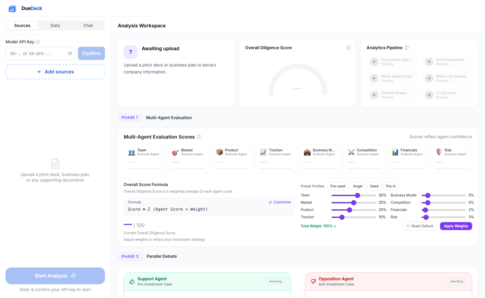
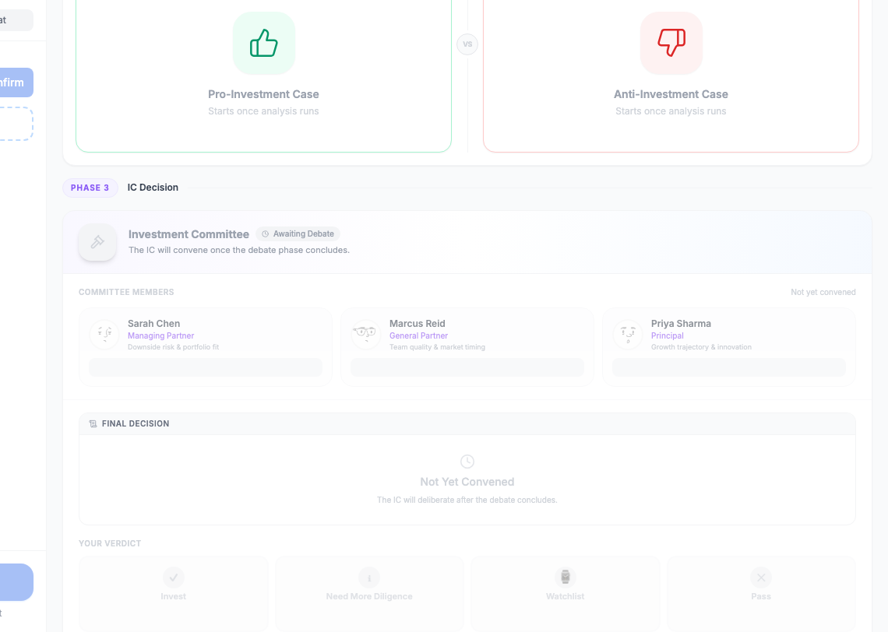
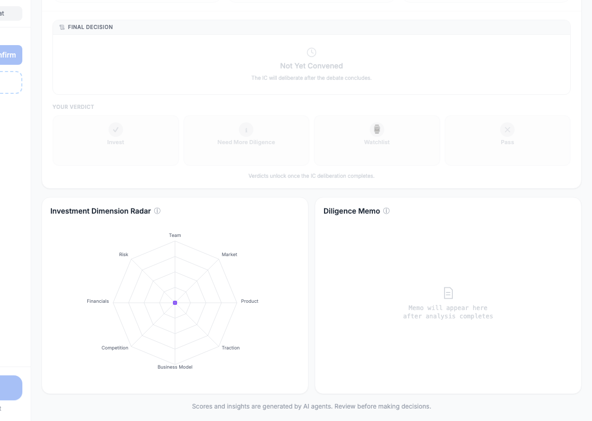
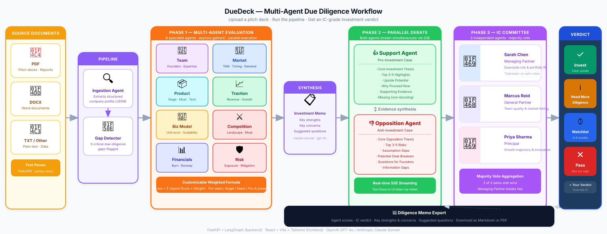

<div align="center">


# DueDeck

### AI-Powered Multi-Agent Venture Due Diligence Platform

[](LICENSE)
[](https://python.org)
[](https://reactjs.org)
[](https://fastapi.tiangolo.com)
[](https://langchain-ai.github.io/langgraph/)
[](https://vitejs.dev)
[](https://tailwindcss.com)

[Features](#features) • [Quick Start](#quick-start) • [Agent Workflow](#agent-workflow) • [Tech Stack](#tech-stack)

</div>

---

**DueDeck** is a multi-agent AI system that simulates a professional VC due diligence process. Upload a pitch deck or business plan and DueDeck deploys a coordinated pipeline of specialized AI agents — analysts, structured debaters, and an independent investment committee — to deliver a three-phase investment assessment in real time.

Supports both **OpenAI** (`gpt-4o`) and **Anthropic** (`claude-sonnet-4-6`) as LLM backends.

---

## Screenshots



<br/>

<table>
  <tr>
    <td width="50%"></td>
    <td width="50%"></td>
  </tr>
  <tr>
    <td align="center"><em>Phase 2 — Support vs Opposition debate streaming in real time</em></td>
    <td align="center"><em>Phase 3 — IC committee members, final decision & radar chart</em></td>
  </tr>
</table>

---

## Features

### Phase 1 — Multi-Agent Evaluation

Eight independent specialist agents score the company in parallel across every dimension VCs care about:

| Agent | Focus |
|---|---|
| 👥 **Team** | Founder backgrounds, domain expertise, team completeness |
| 🎯 **Market** | TAM, market timing, demand signals |
| 📦 **Product** | Stage of development, defensibility, technical moat |
| 📈 **Traction** | Revenue, user growth, key metrics |
| 💼 **Business Model** | Unit economics, revenue structure, scalability |
| ⚔️ **Competition** | Competitive landscape, differentiation |
| 📊 **Financials** | Burn rate, runway, financial planning |
| 🛡️ **Risk** | Key risks, mitigation strategies |

Each agent returns a score (0–100) with detailed analysis, strengths, weaknesses, and missing information flags. Scores feed into a **customizable weighted formula** — adjust weights per investment stage (Pre-seed, Angel, Seed, Pre-A) or write your own formula in natural language.

### Phase 2 — Parallel Debate

Two AI agents argue simultaneously in real time via **streaming LLM output**:

- **Support Agent** — builds the strongest pro-investment case: investment thesis, upside potential, why act now
- **Opposition Agent** — stress-tests the deal: key risks, assumption gaps, potential deal-breakers

Both agents stream concurrently side-by-side. Expand either argument to full-screen for deep reading.

### Phase 3 — IC Decision

Three independent Investment Committee members each call the LLM separately, review all prior analysis, and cast their own vote:

| Member | Role | Focus |
|---|---|---|
| Sarah Chen | Managing Partner | Downside risk & portfolio fit |
| Marcus Reid | General Partner | Team quality & market timing |
| Priya Sharma | Principal | Growth trajectory & innovation |

Votes are aggregated via **majority rule** (Managing Partner breaks ties). The final decision appears as one of: `Invest`, `Need More Diligence`, `Watchlist`, or `Pass` — with detailed reasoning.

After the AI verdict, you cast your own verdict and the result is exported to the **Diligence Memo**.

### Additional Features

- 📄 **Document Q&A** — Chat with your uploaded documents via the sidebar Chat tab
- 🕸️ **Investment Dimension Radar** — Visual spider chart of all 8 agent scores
- 📝 **Diligence Memo Export** — One-click Markdown or PDF export including IC decision, agent scores, key strengths and concerns
- 🔢 **Custom Scoring Formula** — Natural language formula builder (powered by LLM interpretation)
- 📊 **Structured Data Panel** — Parsed company profile: team, market, traction, financials, competitors

---

## Agent Workflow

DueDeck uses a **LangGraph sequential pipeline** with parallel execution inside key nodes:



All events are delivered over **Server-Sent Events (SSE)** — the UI updates live as each agent completes.

---

## Quick Start

### Prerequisites

- Python 3.11+
- Node.js 18+
- An OpenAI or Anthropic API key

### 1. Clone the repository

```bash
git clone https://github.com/HongfeiRichardZhang/DueDeck.git
cd DueDeck
```

### 2. Backend setup

```bash
cd backend
pip install -r requirements.txt
uvicorn main:app --reload --port 8000
```

### 3. Frontend setup

```bash
# From the project root
npm install
npm run dev
```

Open [http://localhost:5173](http://localhost:5173) in your browser.

### 4. Run an analysis

1. **Enter your API key** — OpenAI (`sk-...`) or Anthropic (`sk-ant-...`) in the sidebar
2. **Upload documents** — drag and drop a pitch deck (PDF, DOCX, or TXT)
3. **Click Start Analysis** — watch all three phases run in real time
4. **Cast your verdict** — review the IC decision and record your own judgment

---

## Project Structure

```
DueDeck/
├── backend/
│   ├── main.py          # FastAPI routes (upload, analyze, chat, formula)
│   ├── workflow.py      # LangGraph pipeline definition
│   ├── agents.py        # All agent logic & LLM prompts
│   └── parser.py        # PDF / DOCX / TXT text extraction
│
└── src/
    ├── App.jsx                        # Global state & SSE event handling
    ├── api.js                         # Fetch & SSE client
    ├── constants.js                   # Agent metadata & default weights
    └── components/
        ├── Sidebar.jsx                # Sources / Data / Chat tabs
        ├── Workspace.jsx              # Main layout & phase headers
        ├── Row1Cards.jsx              # Company card, score gauge, pipeline status
        ├── AgentScores.jsx            # 8 agent score cards + weight sliders
        ├── DebatePanel.jsx            # Phase 2 — streaming debate
        ├── ICDecisionPanel.jsx        # Phase 3 — committee votes & verdict
        └── Row3Panels.jsx             # Radar chart + memo export
```

---

## API Reference

| Method | Endpoint | Description |
|--------|----------|-------------|
| `POST` | `/api/upload` | Upload documents, returns `session_id` |
| `POST` | `/api/analyze` | Start analysis pipeline — SSE stream |
| `POST` | `/api/chat` | Document Q&A (single turn) |
| `POST` | `/api/interpret_formula` | Natural language → scoring formula |

---

## Tech Stack

**Backend**
- [FastAPI](https://fastapi.tiangolo.com) — async REST + SSE server
- [LangGraph](https://langchain-ai.github.io/langgraph/) — stateful multi-agent pipeline
- [Anthropic SDK](https://github.com/anthropic-ai/anthropic-sdk-python) / [OpenAI SDK](https://github.com/openai/openai-python) — LLM providers
- [PyMuPDF](https://pymupdf.readthedocs.io) + [python-docx](https://python-docx.readthedocs.io) — document parsing

**Frontend**
- [React 18](https://reactjs.org) + [Vite](https://vitejs.dev)
- [Tailwind CSS](https://tailwindcss.com) — utility-first styling
- [Recharts](https://recharts.org) — radar chart visualization
- [Lucide React](https://lucide.dev) — icons

---

## License

MIT © 2025 DueDeck

---

<div align="center">
  <sub>Scores and insights are generated by AI agents. Review carefully before making investment decisions.</sub>
</div>
